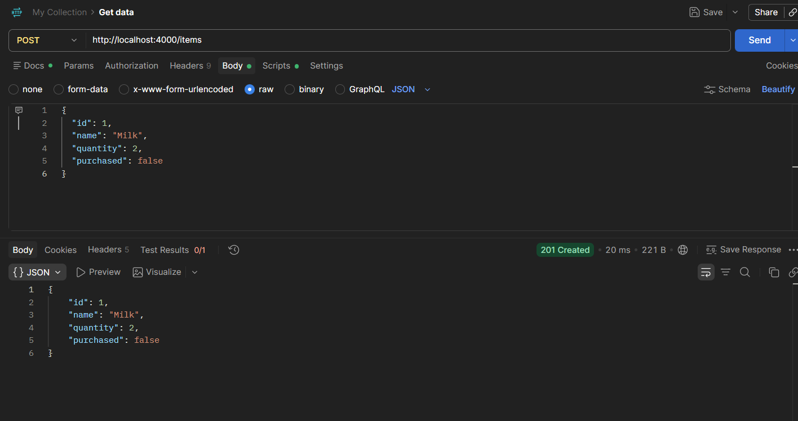
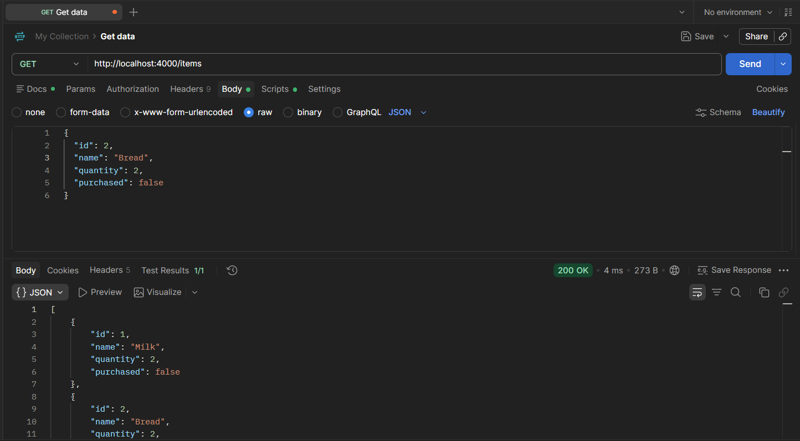
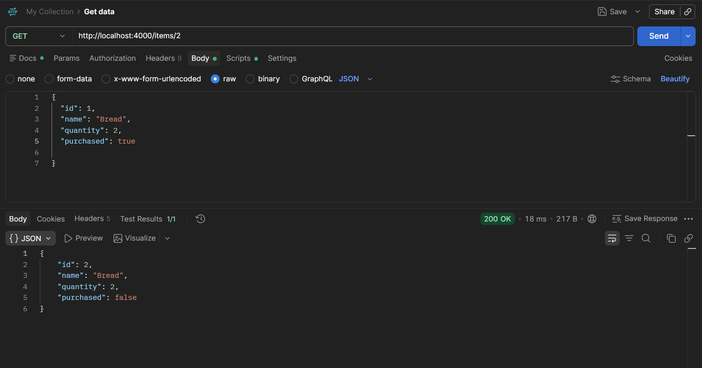
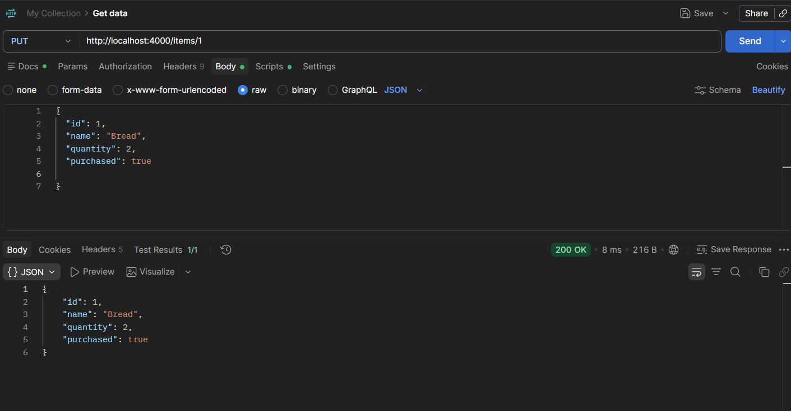
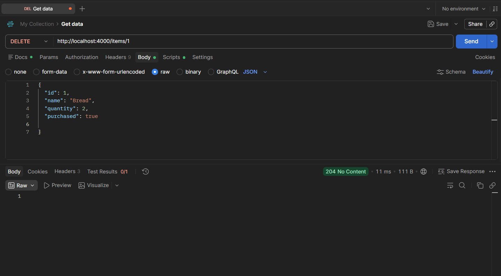
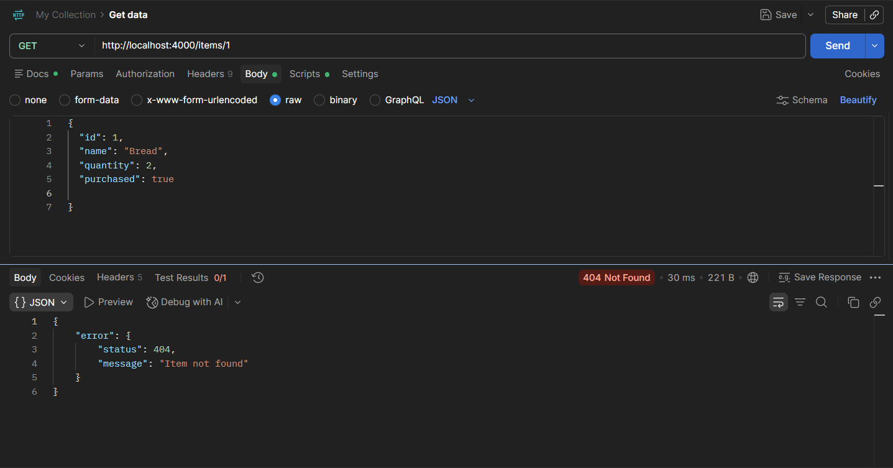

# Shopping List API

A simple REST API for managing shopping list items.

The Shopping List API was built using Node.js and TypeScript. It allows users to create, view, update, and delete shopping items using HTTP requests.

## Features

- Create shopping items
- View all shopping items
- View an item by ID
- Update shopping items
- Delete shopping items
- Validate item data
- Handle API errors
- Return JSON responses

## Technologies Used

- Node.js
- TypeScript
- tsx
- Nodemon
- Postman

## Installation

Clone the repository:

```bash
git clone <your-repository-url>
```

Navigate into the project:

```bash
cd Shopping-List-API
```

Install the dependencies:

```bash
npm install
```

## Running the API

Start the development server:

```bash
npm run dev
```

The server will run at:

```text
http://localhost:4000
```

The API can then be tested using Postman or another API testing tool.

## Item Structure

Each shopping item contains the following properties:

```json
{
  "id": 1,
  "name": "Milk",
  "quantity": 2,
  "purchased": false
}
```

## API Endpoints

The base URL for the API is:

```text
http://localhost:4000
```

### Create an Item

**POST `/items`**

Creates a new shopping item.

Example URL:

```text
http://localhost:4000/items
```

Request body:

```json
{
  "name": "Milk",
  "quantity": 2
}
```

Example response:

```json
{
  "id": 1,
  "name": "Milk",
  "quantity": 2,
  "purchased": false
}
```

Status:

```text
201 Created
```

---

### Get All Items

**GET `/items`**

Returns all shopping items.

Example URL:

```text
http://localhost:4000/items
```

Example response:

```json
[
  {
    "id": 1,
    "name": "Milk",
    "quantity": 2,
    "purchased": false
  }
]
```

Status:

```text
200 OK
```

---

### Get an Item by ID

**GET `/items/:id`**

Returns a single shopping item using its ID.

Example URL:

```text
http://localhost:4000/items/1
```

Example response:

```json
{
  "id": 1,
  "name": "Milk",
  "quantity": 2,
  "purchased": false
}
```

Status:

```text
200 OK
```

If the item does not exist, the API returns:

```json
{
  "error": {
    "status": 404,
    "message": "Item not found"
  }
}
```

Status:

```text
404 Not Found
```

---

### Update an Item

**PUT `/items/:id`**

Updates an existing shopping item.

Example URL:

```text
http://localhost:4000/items/1
```

Request body:

```json
{
  "name": "Milk",
  "quantity": 3,
  "purchased": true
}
```

Example response:

```json
{
  "id": 1,
  "name": "Milk",
  "quantity": 3,
  "purchased": true
}
```

Status:

```text
200 OK
```

If the item does not exist, the API returns a `404 Not Found` response.

---

### Delete an Item

**DELETE `/items/:id`**

Deletes an existing shopping item.

Example URL:

```text
http://localhost:4000/items/1
```

A successful deletion returns:

```text
204 No Content
```

A `204 No Content` response does not contain a response body.

If the item does not exist, the API returns:

```json
{
  "error": {
    "status": 404,
    "message": "Item not found"
  }
}
```

Status:

```text
404 Not Found
```

## Validation

The API validates shopping item data when creating or updating an item.

The following rules are applied:

- `name` must be provided
- `name` must be a string
- `name` cannot be empty
- `quantity` must be a number
- `quantity` must be greater than `0`

For example, the following request is invalid:

```json
{
  "name": "",
  "quantity": 0
}
```

The API returns:

```json
{
  "error": {
    "status": 400,
    "message": "Name must be provided and quantity must be greater than 0"
  }
}
```

Status:

```text
400 Bad Request
```

Invalid JSON also returns a `400 Bad Request` response.

Example:

```json
{
  "error": {
    "status": 400,
    "message": "Invalid JSON"
  }
}
```

## Error Handling

The API uses a reusable error handler to provide consistent JSON error responses.

The error response follows this structure:

```json
{
  "error": {
    "status": 404,
    "message": "Item not found"
  }
}
```

If a route does not exist, the API returns:

```json
{
  "error": {
    "status": 404,
    "message": "Route not found"
  }
}
```

## Postman Testing

The API endpoints were tested using Postman.

The following functionality was tested:

- Creating an item
- Getting all items
- Getting an item by ID
- Updating an item
- Deleting an item
- `400 Bad Request` responses
- `404 Not Found` responses

### POST - Create Item



### GET - Get All Items



### GET - Get Item by ID



### PUT - Update Item



### DELETE - Delete Item



### Error Handling



## Data Storage

The API uses an in-memory array to store shopping items.

This means the shopping items are stored temporarily while the server is running.

When the server is stopped or restarted, the stored shopping items are cleared.

## Author

**Sharon Mashai**

* GitHub: [Sharon-Mashai](https://github.com/Sharon-Mashai)